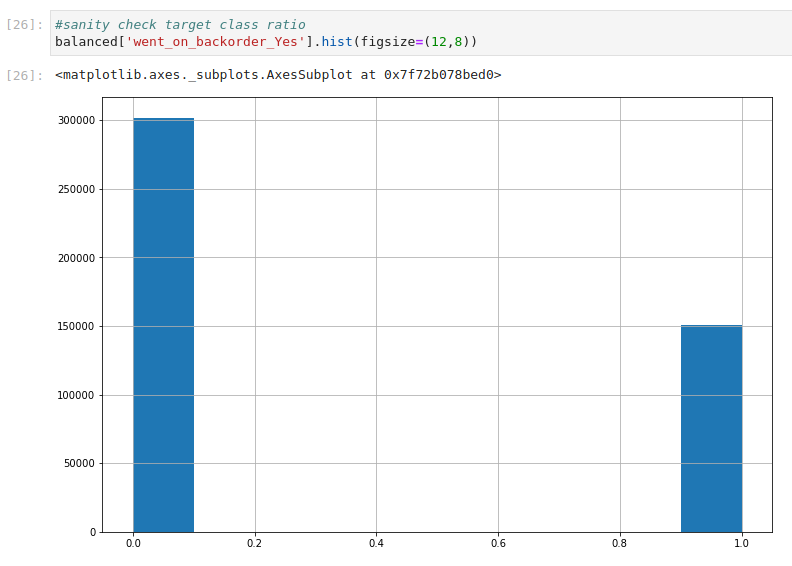

# Can we predict backorder?

  

# Introduction

Effective supply chain management is an integral part of many businesses and essential to business success, customer satisfaction, and operational costs management. 
The goal of a supply chain is to have an item in stock when a customer is ready to purchase the item, in the cheapest and fastest means possible.

One of the common challenges in supply chain management is the complexity associated with predicting backorder. Luckily with the current data growth and advances in predictive analytics and artificial intelligence, machine learning could rescue supply chain managers from this daunting task.

In this project, I demonstrate using powerful python open source libraries and packages (pandas, scikit-learn, TensorFlow, and Keras) to build a model that predicts items that are more likely to backorder given some input features.

Once satisfied with the model results, I’ll deploy the predictive solution as a web service through Heroku, a Platform as a Service (PaaS) application, where any user will be able to input required item features and receive a prediction whether that item is or is not likely to backorder within the next eight weeks.  

# Data Collection

The dataset is retrieved from Kaggle and contains **1.687 million records of inventory data** for eight weeks prior to the week we want to predict backorder for.

The dataset contains the following features:

- sku - A unique identifier for each product
- national_inv - Current inventory level for the product    
- lead_time - Transit time for product (if available)
- in_transit_qty - Amount of product in transit from source
- forecast_3_month - Forecast sales for the next 3 months
- forecast_6_month - Forecast sales for the next 6 months
- forecast_9_month - Forecast sales for the next 9 months
- sales_1_month - Sales quantity for the prior 1 month time period
- sales_3_month - Sales quantity for the prior 3 month time period
- sales_6_month - Sales quantity for the prior 6 month time period
- sales_9_month - Sales quantity for the prior 9 month time period
- min_bank - Minimum recommend amount to stock
- potential_issue - Source issue for part identified
- pieces_past_due - Parts overdue from source
- perf_6_month_avg - Source performance for prior 6 month period
- perf_12_month_avg - Source performance for prior 12 month period
- local_bo_qty - Amount of stock orders overdue
- deck_risk - Part risk flag
- oe_constraint - Part risk flag
- ppap_risk - Part risk flag
- stop_auto_buy - Part risk flag
- rev_stop - Part risk flag
- went_on_backorder – backorder indicator (Yes-backordered, No - Not backorder)

For detailed code and dataset structure information see: **[01. File_Exploration.ipynb](https://github.com/mfalila/supply_chain_analysis/blob/master/notebooks/01.%20File_Exploration.ipynb)**

# Exploratory Data Analysis
- I explored the data in two stages, to:
	1. Understand the data, and
	2. Understand the typical profile of an item that backordered in the past eight weeks.

My goal here was to extract meaningful insights from our feature set that our model will use as signal for learning the general pattern of  typical backordered items, a process known as generalization. Generalization is what will help our final model perform well on unseen data. 

- To understand the data, I took the following steps and made the following observations:
	1. Ensured no duplicate samples, by verifying the dataset has only one record per “sku.”
	2. Explored missing data, outliers, and important feature correlations and handled them accordingly.
	3. Explored data distributions and noted a highly imbalanced dataset (only 6% instances of backorder).
	

  

			iv. Performed a univariate outlier analysis and noted a high presence of possible data outliers in the dataset

For detailed code and charts on exploratory data analysis please see: **[02(a). Data_Exploration](https://github.com/mfalila/supply_chain_analysis/blob/master/notebooks/02.%20Data_Exploration/02(a).%20Data_Exploration.ipynb)**

- To understand the typical profile of a backordered item, I
	1. Evaluated linear correlations in the dataset and removed multicollinear features to reduce our problem’s feature space. 
	2. Performed statistical tests of significance to uncover important data signals for typical backordered items.
		- I noted the following:
			- Items with low inventory, low lead times, low quantities in transit, and low supplier performance are significantly more likely to backorder.
			- Items with a high sales forecast are significantly more likely to backorder.
 - For detailed code on **identifying hidden data relationships** please see: **[02(b). Data_Exploration_Numericals](https://nbviewer.jupyter.org/github/mfalila/supply_chain_analysis/blob/43255a2a6eee7e45d5fc924f6cfa130b14e5e38b/03(a).%20Data_Exploration-Numericals.ipynb)** and **[02(c) Data_Exploration_Categoricals](https://github.com/mfalila/supply_chain_analysis/blob/master/notebooks/02.%20Data_Exploration/02(c)%20Data_Exploration-Categoricals.ipynb)**
		

# Data Preprocessing

To prepare or data for modeling, I performed the following actions:

- Tested various methods for handling the data imbalance identified during data exploration and selected a to use a combination of under-sampling the majority sample and over-sampling the minority sample using the Synthetic Minority  Oversampling Technique (SMOTE).

  

For detailed code and charts on handling the dataset imbalance please see: **[03(a). Data_Imbalance.ipynb](https://github.com/mfalila/supply_chain_analysis/blob/master/notebooks/03.%20Data_Preprocessing/03(a).%20Data_Imbalance.ipynb)**

- Performed feature engineering to add important data relationships (signals) uncovered during EDA. 
The following features were added: 
	* ‘‘low_inventory”
	* “low_lead_time”
	* “low_qty_intransit”
	* “high_forecast”
	* “low_perfomance”

For detailed code on feature engineering steps please see: **[3(b). Feature_Engineering.ipynb]()**

